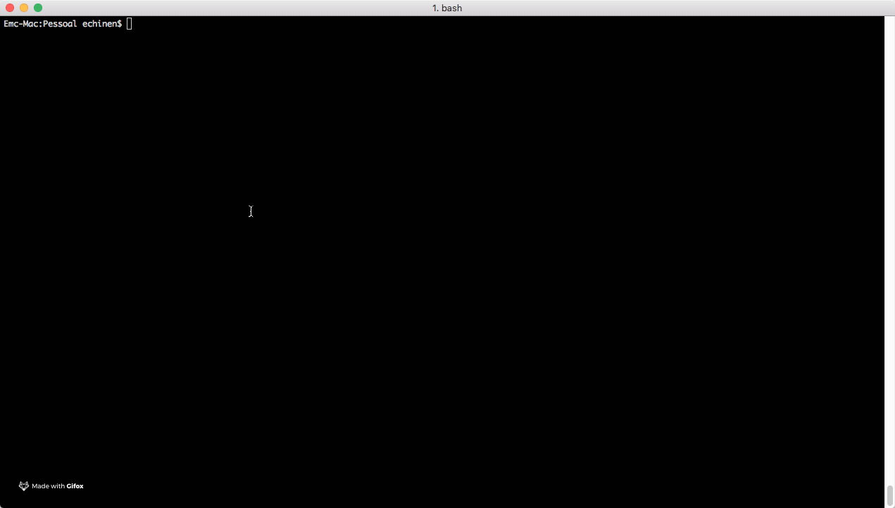
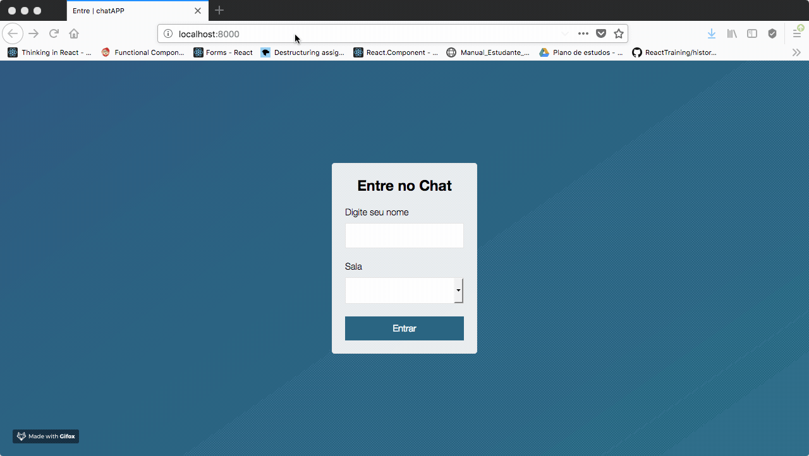
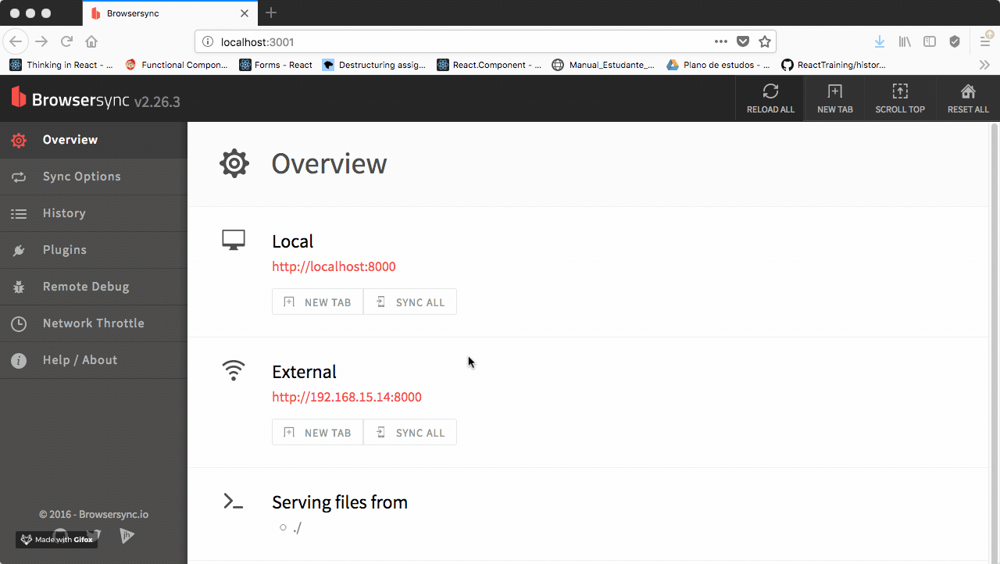
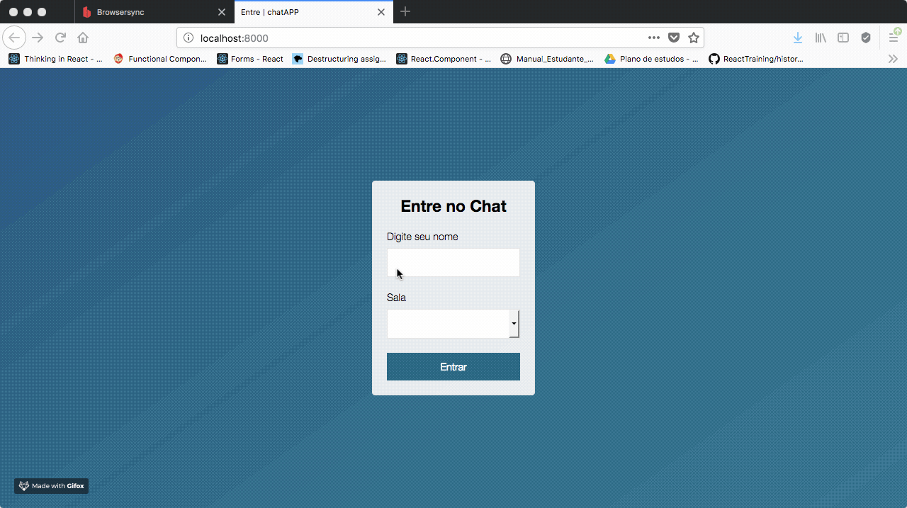
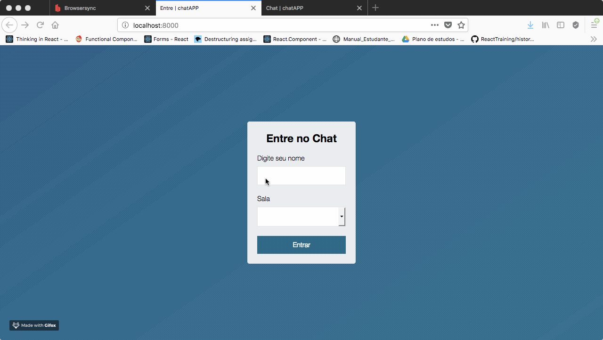
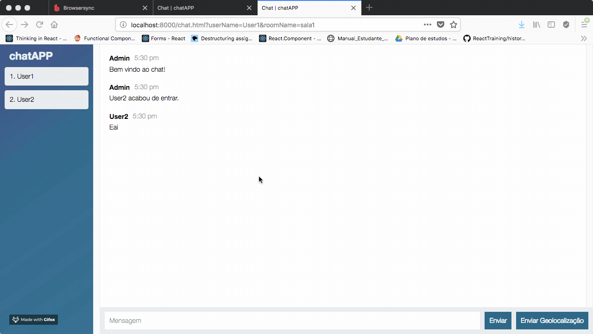
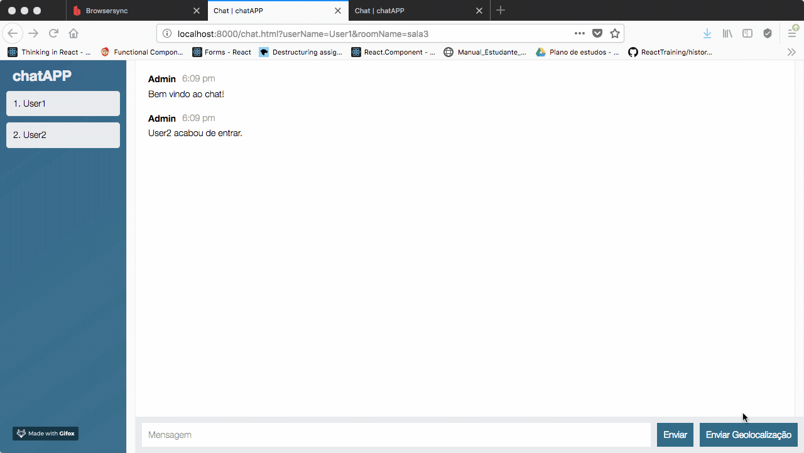

## chat-app (frontend)

### Requisitos de instalação

Primeiramente instale o browsersync globalmente utilizando o comando: 
``` bash
npm install -g browser-sync
```

### Executando o app (frontend)

Para inicar o app vá para a pasta de ./frontend e em seguida execute o comando abaixo:
``` bash
cd frontend/
browser-sync start --config bs-config.js
```



### Painel admin do Browser-Sync

Abrindo o painel admin.




Habilitando novas abas para novos usuários.




### Funcionalidades do app

Criando um usuário para uma determinada sala.



Novo usuário para uma determinada sala.



Usuário saindo e calculando tempo de permanência na sala.



Compartilhando localização.

